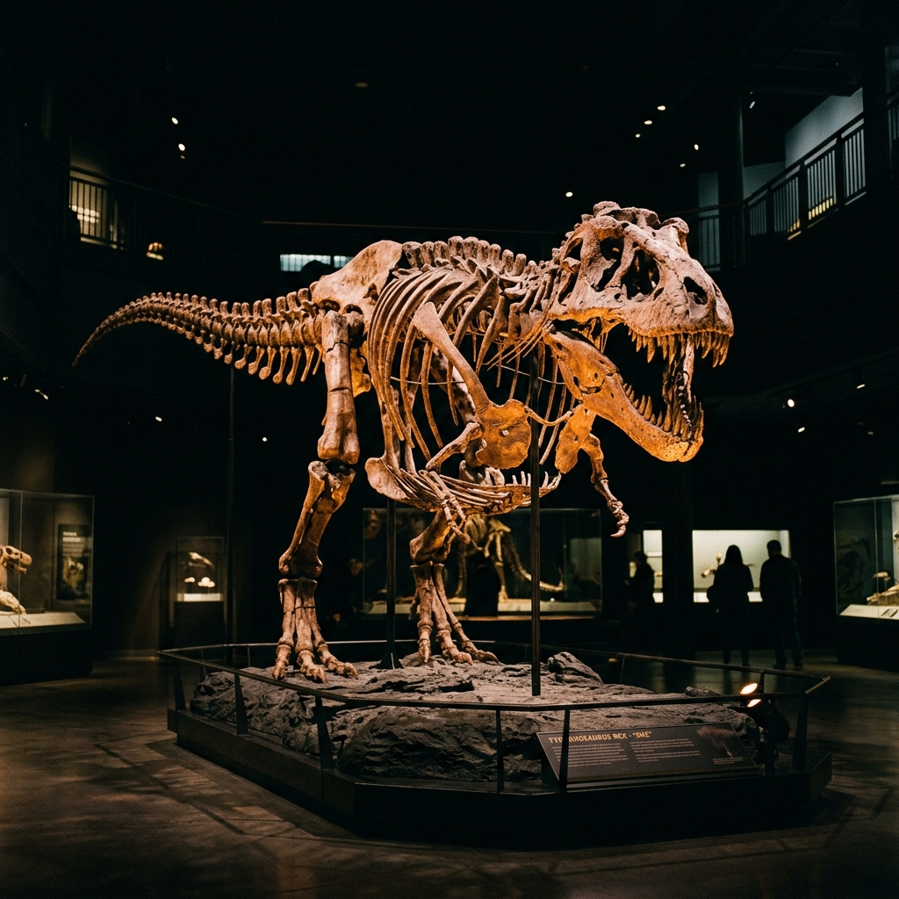

# Realm Dino Museum

<p align="center">
  
</p>

<p align="center">
  An immersive virtual dinosaur museum built with React, Vite, Three.js, Cesium, and Supabase.
</p>

<p align="center">
  <a href="https://react.dev"></a>
  <a href="https://vite.dev"></a>
  <a href="https://threejs.org"></a>
  <a href="https://cesium.com"></a>
  <a href="https://supabase.com"></a>
  <a href="https://tailwindcss.com"></a>
</p>

<p align="center">
  
  
  
  
  
  
</p>

## Preview

<p align="center">
  
</p>

<p align="center">
  
</p>

## Overview

Realm Dino Museum is a cinematic web experience that combines:

- a story-driven landing page with animated media and ambient audio
- a first-person 3D museum walkthrough
- era-based dinosaur scenes at `/era/:slug`
- a globe exploration experience powered by Cesium
- Supabase-backed content so media, exhibits, and environments can be updated without hardcoding everything in the UI

This repository is the frontend application for the museum experience.

## Highlights

- Immersive homepage with hero video, motion typography, and curated audio controls
- 3D museum scene with interactive fossil gateways
- Dinosaur era pages with environment loading and revive-style effects
- Cesium-powered fossil exploration routes
- Supabase Auth support with modal login/register flow
- Asset prefetching to reduce perceived loading before entering heavy 3D scenes

## Tech Stack

### Core

- `React 19`
- `Vite 8`
- `react-router-dom`
- `Tailwind CSS v4`

### 3D and Motion

- `three`
- `@react-three/fiber`
- `@react-three/drei`
- `cesium`
- `resium`
- `framer-motion`
- `gsap`
- `lenis`

### Backend and Services

- `@supabase/supabase-js`
- Supabase tables for scenes, dinosaurs, exhibits, facts, and site media

## Application Routes

| Route | Purpose |
| --- | --- |
| `/` | Landing page and entry flow |
| `/museum` | Main virtual museum scene |
| `/era/:slug` | Era-specific dinosaur environment |
| `/explore` | Globe-based fossil explorer |
| `/archive` | Alternate fossil archive route |

## Project Structure

```text
.
|-- public/
|   |-- audio/         # Ambient audio assets
|   |-- icons/         # Branding and favicon assets
|   |-- images/        # Posters, dinosaur images, specimen visuals
|   |-- sequences/     # Legacy image-sequence frames
|   `-- video/         # Hero video assets (tracked with Git LFS)
|-- src/
|   |-- components/
|   |   |-- auth/
|   |   |-- common/
|   |   |-- home/
|   |   |-- layout/
|   |   |-- museum/
|   |   `-- scene/
|   |-- context/
|   |-- hooks/
|   |-- pages/
|   |-- services/
|   `-- utils/
|-- supabase/
|   |-- migrations/
|   `-- supabaseclinet/
|-- index.html
|-- vite.config.js
`-- package.json
```

## Local Development

### Prerequisites

- Node.js 18+
- npm
- A Supabase project with the expected tables and public asset URLs

### Install

```bash
npm install
```

### Start the dev server

```bash
npm run dev
```

Default local URL:

```text
http://localhost:5174
```

### Build for production

```bash
npm run build
```

### Preview production build

```bash
npm run preview
```

### Lint

```bash
npm run lint
```

## Environment Variables

Create a local `.env` file:

```env
VITE_SUPABASE_URL=https://your-project.supabase.co
VITE_SUPABASE_PUBLISHABLE_KEY=your_publishable_key
VITE_SUPABASE_ANON_KEY=your_anon_key
```

Notes:

- The app prefers `VITE_SUPABASE_PUBLISHABLE_KEY`
- `VITE_SUPABASE_ANON_KEY` is used as a fallback
- If env values are missing, the frontend uses guarded Supabase initialization instead of crashing immediately

## Supabase Data Expectations

The frontend expects these tables or equivalent data sources:

- `scene_assets`
- `eras`
- `exhibits`
- `dinosaurs`
- `dinosaur_facts`
- `fossil_locations`
- one of `site_assets`, `museum_assets`, or `media_assets`
- `profiles`

## Media and Git LFS

Large hero videos are tracked with Git LFS.

If you clone this project for full media support:

```bash
git lfs install
git lfs pull
```

Tracked media patterns currently include:

- `public/video/*.mp4`
- `public/video/*.webm`

## Deployment

This project is suitable for static frontend deployment on platforms such as Vercel.

Recommended deployment flow:

1. Import the repository into Vercel.
2. Add Supabase environment variables in project settings.
3. Redeploy after changing env values.
4. Verify route rewrites for `BrowserRouter`.
5. Verify Cesium and Supabase-backed scenes in production.

## Implementation Notes

- Routing uses `BrowserRouter`, so refreshes on nested routes require host-level rewrite support
- Hero video and ambient audio are local-first, with optional Supabase-backed media overrides
- Cesium is enabled through `vite-plugin-cesium`
- `supabase/supabaseclinet/supabase-clinet.ts` exists as a compatibility re-export for legacy imports

## Scripts

```json
{
  "dev": "vite",
  "build": "vite build",
  "lint": "eslint .",
  "preview": "vite preview"
}
```

## License

No license file is currently included in this repository.
If you plan to open-source it publicly, add a license before wider distribution.
